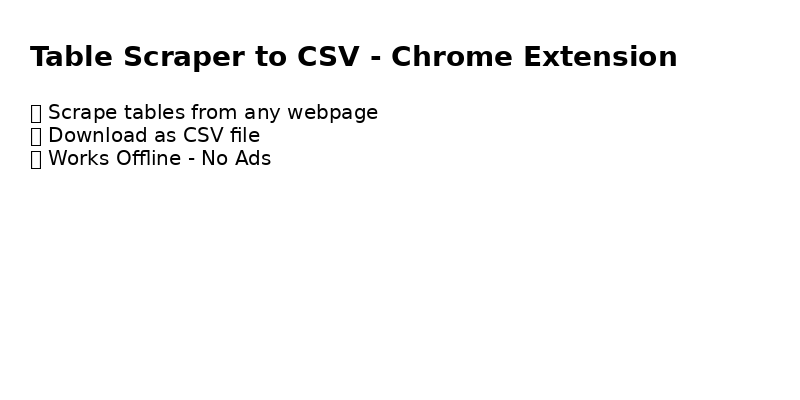

# 📋 Table Scraper to CSV - Chrome Extension

This Chrome Extension allows you to extract any HTML table from a webpage and download it as a CSV file with a single click.

🚀 **Simple, Fast, and Offline. No Ads.**

---

## 🌟 Features

- ✅ Scrape tables from any webpage  
- ✅ Preview data before downloading  
- ✅ Download as `.csv` file  
- ✅ Works offline (no API calls)  
- ✅ Lightweight and easy to use  

---

## 🛠️ How to Use

1. Download or clone this repository.
2. Open Chrome and go to `chrome://extensions`.
3. Turn on **Developer mode** (top right corner).
4. Click **"Load unpacked"** and select this extension folder.
5. Visit any webpage with tables.
6. Click the extension icon and hit **"Download CSV"**.

---

---

## ☕ Donate

If you find this tool helpful, you can support me with a small donation 💖

- 💸 EasyPaisa / JazzCash: **0310-1374973**

---

## 👨‍💻 Author

Made with ❤️ by [Pyali786](https://github.com/Pyali786)

---

## 📄 License

This project is **100% free** to use for personal and commercial purposes.

> ⭐ If you like this project, please give it a star and share it with others!

